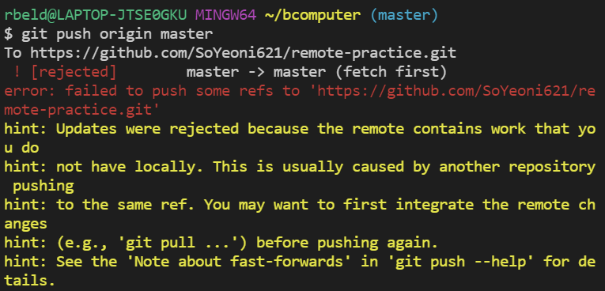
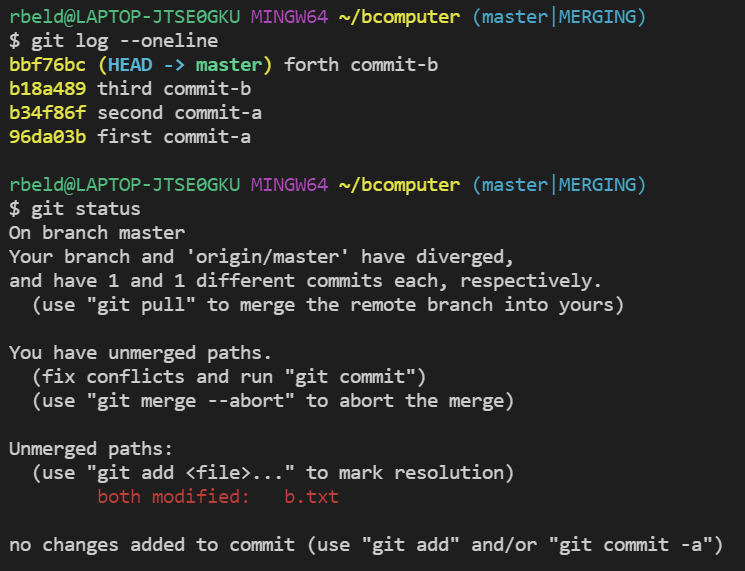

# 1. Github
## 1) Github 가입하기
- 모든 웹사이트가 그러하듯 알아서 회원가입을 하면 된다.
## 2) Github 설정변경
1. 상단 프로필 클릭
2. `Settings` 클릭
3. `Repositories` 선택, `main`을 `master`로 변경
4. `Update` 클릭

> 2020년에 Black Lives Matter라고 하는 아프리카계 미국인을 향한 폭력과 제도적 인종주의에 반대하는 사회운동이 있었습니다. Github는 기본 브랜치 이름이었던 master가 주인과 노예 (master and slave)를 떠올리게 하는 것을 개선하기 위해 main 이라는 이름으로 기본 브랜치의 이름을 변경했습니다. 
>
> 하지만 수업에서는 진행 상 편의를 위해서 master 브랜치를 사용하도록 하겠습니다.

이런 이유로 나도 `master`로 사용예정

## 3) Remote Repository
1. Github에 원격 저장소 생성
- `New repository` 생성


2. 로컬 저장소와 원격 저장소 연결

- TIL 폴더 생성 후 vscode 열기
- git init 을 통해 로컬 저장소로 만들기
- git remote add 이름 주소

```bash
$ git remote add origin https://github.com/SoYeoni621/TIL.git
```

- ```git remote -v```하면 원격 저장소 조회가 가능하다.


3. 원격저장소에 커밋 올리는 법

- ```git add .```와 `git commit -m "수정사항"`로 로컬저장소에 커밋 생성
- `git log --oneline`으로 커밋 확인 가능
- `git push origin master # git push 저장소 이름 브랜치 이름`로 업로드한다.


# 2. gitignore

## 1) gitignore?

특정 파일 혹은 폴더에 대해 Git이 버전 관리를 못하게 하는 것

## 2) 작성방법

* ___반드시___ `.gitignore`로 작성할 것!!!!!!!

* `.gitignore` 파일 안에 버전 관리 하지 않을 파일들을 입력해준다.

* 쉽게 작성하는 법

  [검색해서 복사, 붙여넣기하면 끝](https://www.toptal.com/developers/gitignore)


# 3. clone, pull

## 1) clone

원격 저장소를 내 저장소로 가져오는 법

* `git clone 원격저장소주소`코드를 사용

* `git clone`을 통해 생성된 로컬 저장소는 `git init`과 `git remote add`가 이미 수행되어 있다.


## 2) pull

원격 저장소의 변경사항을 가져와 로컬 저장소를 업데이트한다.

로컬 저장소와 원격 저장소의 내용이 완벽하게 일치하면 아무일도 일어나지 않는다.

* `git pull 저장소이름 브랜치이름`코드를 사용


> `git clone`은 처음 한 번만 사용한다(init처럼). `git pull`은 변경 사항이 있을 때 마다 들고 올때 한다


## 3) 충돌이 일어날 때

원격 저장소와 로컬 저장소에서 같은 파일, 같은 라인을 수정했을 때 발생



* 어느 내용을 반영할 지 선택한 후 `git add .`와 `git commit`을 이용해서 새로 쌓아나가면 해결



_마지막 줄을 보면 친절하게 어떻게 해결하면 되는지 알려주고 있다._
